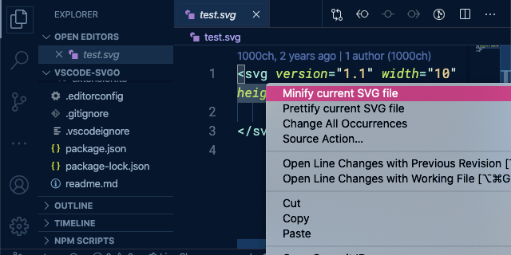

# vscode-svgo 

Fully featured [SVGO](http://github.com/svg/svgo) plugin for [Visual Studio Code](https://github.com/microsoft/vscode).

## Install

Execute `Extensions: Install Extensions` command from [Command Palette](https://code.visualstudio.com/docs/getstarted/userinterface#_command-palette) (<kbd>Cmd</kbd> <kbd>Shift</kbd> <kbd>P</kbd>) and search by **svgo**.

Also you can install this extension locally by putting symbolic link from `~/.vscode/extensions` to `~/path/to/this/repo` like below.

```bash
$ ln -s ~/workspace/github.com/1000ch/vscode-svgo  ~/.vscode/extensions/1000ch.svgo-local
```

## Usage

Open the Command Palette (<kbd>Cmd</kbd> <kbd>Shift</kbd> <kbd>P</kbd>) and search following commands.

- **svgo: Minify current SVG file**: to minify current SVG file
- **svgo: Format current SVG file**: to format current SVG file

You can also execute these commands from context menu of [Explorer](https://code.visualstudio.com/docs/getstarted/userinterface#_explorer) or Editor.



## Config

### Extension config

You can enable/disable [plugins](https://github.com/svg/svgo/blob/master/docs/how-it-works/en.md#3-plugins) via [Configure Extension Settings](https://code.visualstudio.com/docs/editor/extension-gallery#_configuring-extensions).

### Project config

[To configure with `svgo.config.js`](https://github.com/svg/svgo#configuration), just put the config file in project root.

## License

[MIT](https://1000ch.mit-license.org) © [Shogo Sensui](https://github.com/1000ch)
